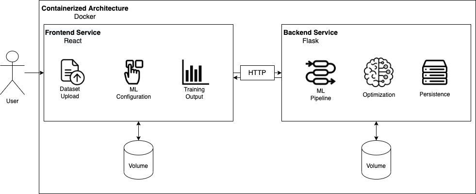
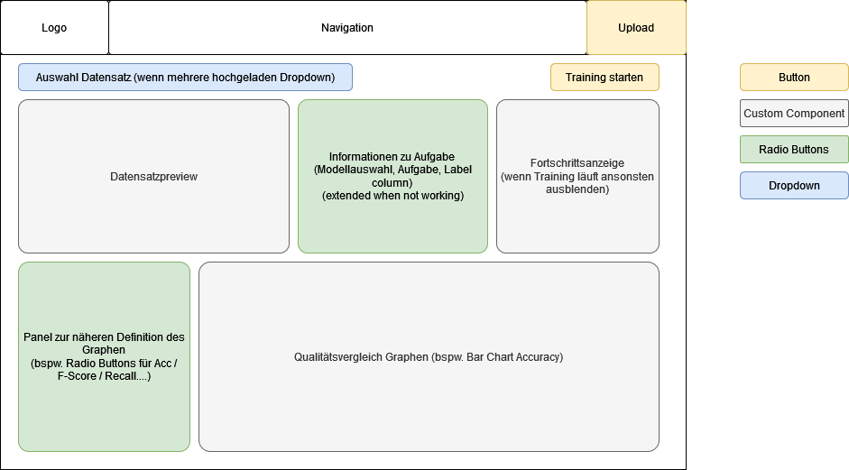
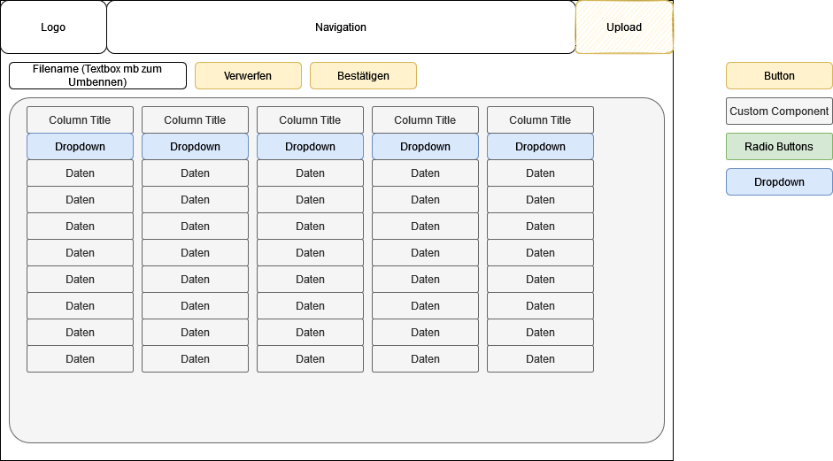
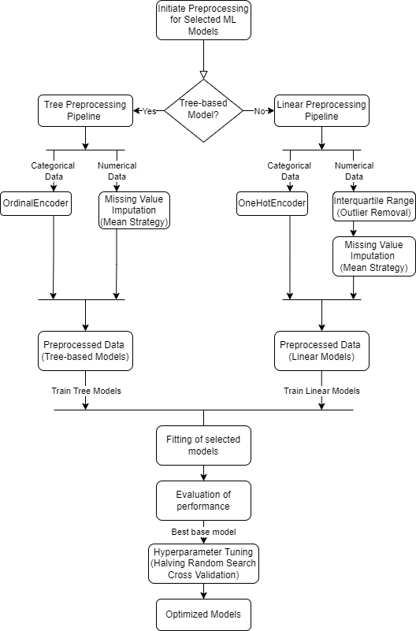
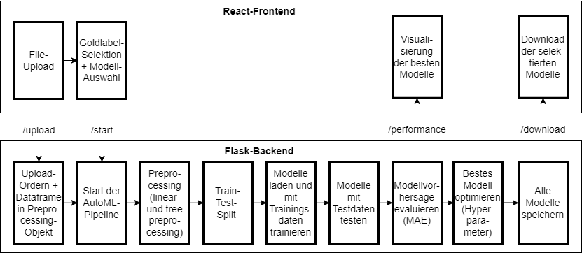

# AutoMLatically



This project is concerned with the implementation of a Auto Machine Learning (AutoML) framework. 
The software has a user-facing frontent (React Website) and a ML performing backend (Flask API server).

The ML framework is focussed on **supervised learning** algorithms. Hence, the provided dataset must have a column with labels/target variables.

---
### 1. Software requirements
Frontend UI displays:
- A selection mechanism for ML models that will be trained afterwards
- Option to upload a dataset in CSV format
- selection mechanism for the dataset's label column
- Performance metrics of trained ML models
- Buttons to download trained models
- The components visualized in the [docs folder](./docs/)

Backend that provides the following:
- API to process the following frontend requests: 
    - Receive uploaded dataset 
    - Receive the dataset's label column
    - Receive the ML model selection 
    - Request to initiate model training
    - Request to download specific trained Models
- The API sends the following requests back to the frontend:
    - The requested Model data
    - The performance measures of the ML models
- Logic to preprocess the dataset
- Logic to create and train selected ML models
- Logic to calculate performance measures
- Logic to tune the hyperparameters of the models
- Logic to store trained models, so that they can be send to the frontend if requested

These requirements were used to create paper prototypes for the frontend UI.

**Initial Prototype for Homepage:**


**Initial Protoype for Upload Page:**


During the development a reworked and improved Protype was developed. That was composed of a single page.

**Reworked Homepage:**


---

### 2. Setup

<br>

#### 2.1 Prerequisits
You need Docker installed on your local machine. You can follow [these](https://docs.docker.com/engine/install/) instructions to install it. Make sure you have docker-compose installed as well. If you did install Docker Desktop, you already have it enabled. Otherwise you can follow [these](https://docs.docker.com/compose/install/) instructions. 

<br>

#### 2.2 Build and Start
To build and run all containers, run this in the main directory of this repo:

```bash
docker-compose up --build
```

To build individual services run this in the main directory:

```bash
docker-compose build <service-name>
```

Replace <service-name> with one of the following:
- frontend
- middleware
- backend

> NOTE: If you experience issues while starting the containerized application it is probably because the dependency for the frontend service are not installed properly. Run the following command to install the dependencies properly:

```bash 
docker run -v "$PWD"/frontend:/app node:18 npm install --save --prefix /app
```

> ONLY Windows users: change the "$PWD" to the absolute path of this repository (C://)


---
### 3. Cooperation

The project is organized with a Trello Kanban Board, which is available [here](https://trello.com/b/lVgtr38t/automlatically).

The members of project team are:
- Alina Buss
- Canberk Alkan
- Dominic Viola
- Phillip Lange

---
### 4. Backend 
The backend is responsible for providing the frontend with information like ML-model names, training performance and model files. 

#### 4.1 ML Process
The ML process is documented in the following flow chart. It displays which steps are performed after the user selects a CSV file, a gold label and a selection of ML models in the frontend.


#### 4.2 API Docs
List of Endpoints:

/upload (POST) -> send the CSV data file from the frontend to the backend. Input: -

/start (POST) -> intitiate the training process of the selected models. Input: {selected_models: [model_names], gold_label: "label"}

/performance (GET) -> receive the performance metrics from the training process in a JSON format. Input: -

/model-names (GET) -> Receive the names of the available models and if they are regression or classification models. Input: -

/download (GET) -> download the specified trained ML model from the backend and send them to the frontend. Input: {model_name: e.g. "linear_regression" or "best"}

Backend internal naming convention for trained ML model files: "ranking_nameOfModel" for example: "0_linear_regression" if the linear regression is the best (0) model performance

### 5. Frontend and Backend Interaction

The process flow throughout this project is visualized in the following picture.

